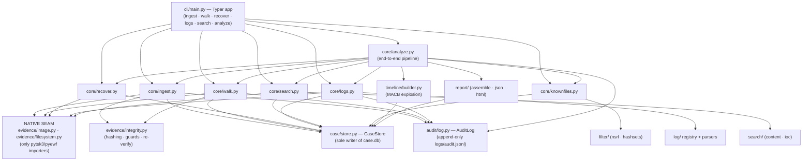

<!-- generated-by: gsd-doc-writer -->
# Architecture

## System overview

PyAutopsy is a forensically-sound, read-only disk-image analysis pipeline built
on The Sleuth Kit (TSK) via the `pytsk3` bindings (and `pyewf` for E01/EWF
containers). Its input is a raw (`dd`) or E01 disk image plus the on-disk logs
that image contains; its output is a self-contained **case directory** holding a
SQLite case database (`case.db`), an append-only JSONL audit log
(`logs/audit.jsonl`), and a deterministic report set (`reports/report.json` and
`reports/report.html`). The architecture is a strict **layered pipeline** with
two hard internal boundaries: a single native-binding *seam* through which all
TSK/EWF access flows, and a single *sole-writer* `CaseStore` through which all
database access flows. Every stage opens the evidence read-only at the byte
layer, never mounts or writes it, and records only reproducible analytical
content so that two runs over the same image produce byte-identical reports.

## Component diagram

The system is organized into three tiers. The **native seam** is the only place
`pytsk3`/`pyewf` are imported; the **orchestration tier** composes the lower
tiers into auditable operations; the **persistence and reporting tier** owns the
case database and renders the deliverables.



The arrows from the orchestrators to **SEAM** mean "reads bytes through"; arrows
to **STORE** mean "reads/writes rows through"; arrows to **AUDIT** mean "appends
events to".

## Data flow

A typical end-to-end run is the `analyze` command, orchestrated by
`run_analyze` in `core/analyze.py`. It composes the per-stage orchestrators,
each of which is also independently invocable from the CLI:

1. **Validate + ingest** (`core/ingest.py:run_ingest`). The case directory is
   refused if it overlaps the evidence path (`_assert_case_dir_separate`,
   decision D-01), and the source is refused if it is a mounted filesystem
   (`integrity.assert_source_not_mounted`). `CaseStore.create` materializes the
   `<case>/`, `<case>/logs/`, `<case>/exports/` layout and `case.db`. The image
   is opened read-only through the native seam (`evidence/image.py:open_image`),
   hashed in a single pass (`integrity.hash_image`, MD5 + SHA-256), optionally
   compared against a supplied acquisition hash, persisted as `cases` +
   `evidence_sources` rows in one transaction, and **re-verified at end of run**
   so any in-run drift is a loud `IntegrityError`.
2. **Walk** (`core/walk.py:run_walk`). Volumes are enumerated through the FS
   seam (`evidence/filesystem.py:enumerate_volumes`); each filesystem is opened
   (`open_fs`) and walked (`walk_fs`), yielding every entry — including deleted
   ones. Each entry is mapped to a `FileRow`: META-01 spine (path, name, inode/
   MFT address, allocated status, volume tagging), normalized MACB timestamps
   (UTC ISO-8601, FAT local-time handling, zero-epoch → `None`), ownership/mode,
   and — for allocated regular files — MD5/SHA-1/SHA-256 plus a content-signature
   file type. An encrypted/unsupported volume becomes a `VolumeLimitation`
   finding and the walk **continues** rather than aborting (decision D-20).
3. **Optional recovery / filtering** (`core/recover.py`, `core/knownfiles.py`).
   When requested, recovery writes recovered deleted/orphan `FileRow`s; known-file
   filtering annotates rows with neutral NSRL / allow-block `KnownMatch`
   provenance (never a good/bad verdict).
4. **Timeline** (`timeline/builder.py:build_timeline`). Each `files` row is
   exploded into up to four `TimelineEvent`s — one per populated MACB timestamp
   — copying the walk's `*_utc` string **verbatim** (timestamps are never
   re-derived from an epoch here).
5. **Optional logs / search** (`core/logs.py`, `core/search.py`). Log parsing
   discovers rotated/gz log sets, parses each member through the log-parser
   registry, time-resolves records with honest tz/year flags, and writes
   `TimelineEvent`s into the **same** `timeline_events` table — so the existing
   ordered read becomes the super-timeline with no new ordering code. Content
   search writes `SearchHit` rows.
6. **Report** (`report/`). `assemble_report_body` reads the persisted rows back
   through the store into one deterministic body dict; `write_json` and
   `render_html` emit `reports/report.json` and `reports/report.html`. The only
   wall-clock value (generation timestamp, host) is segregated into a separate
   `reports/run_metadata.json` sidecar so the two reports stay byte-identical
   across runs.

Throughout, every stage appends structured events to `logs/audit.jsonl` via
`audit/log.py:AuditLog`, and a terminal `*.error` / `*.crashed` FAIL event is
always written before any exception propagates.

## Key abstractions

| Abstraction | Kind | File | Role |
|-------------|------|------|------|
| `ReadableImage` | Protocol | `evidence/image.py` | The byte-layer `read`/`get_size`/`close` contract every image handle satisfies; downstream tiers depend on this, never on a concrete native type. |
| `ImageHandle` | dataclass | `evidence/image.py` | Read-only, plain-Python handle over an opened image (raw `Img_Info` or the `EWFImgInfo` adapter) plus size/format/path. |
| `FileEntry` | dataclass | `evidence/filesystem.py` | The plain-Python value object the FS walk yields per entry (primitive fields + a single `read_random` byte-reader closure); no native `File` object escapes the seam. |
| `CaseStore` | class | `case/store.py` | The sole sanctioned reader/writer of `case.db` — owns the schema, WAL + foreign-key pragmas, transactions, and every typed repository method. |
| `AuditLog` | class | `audit/log.py` | The append-only JSONL audit writer, confined to `<case>/logs/audit.jsonl` with `O_APPEND` + `fsync`. |
| `LogParser` / `ParsedRecord` | Protocol / dataclass | `log/registry.py` | The log-format extension contract (`name` + `matches` + `parse`) and its emitted value object; the primary extension point (see below). |
| `FileRow`, `TimelineEvent`, `EvidenceSource`, `Case`, `VolumeLimitation`, `KnownMatch`, `SearchHit`, `AuditEvent` | dataclasses | `case/models.py` | The frozen value models mirroring the typed columns of each `case.db` table, each carrying a JSON `attributes` blackboard for schema-free extension. |
| `safe_extract` | function | `util/safe_extract.py` | The only sanctioned archive expander — path-confined, symlink/device-refusing, decompression-bomb-capped jail for untrusted archives. |
| `run_ingest` / `run_walk` / `run_recover` / `run_logs` / `run_search` / `run_filter` / `run_analyze` | functions | `core/*.py` | The orchestration-tier entry points the CLI commands wrap one-to-one. |

## Forensic-soundness boundaries

Three architectural invariants enforce the project's forensic-soundness
constraint. They are not conventions but structural boundaries verified by tests
(`tests/test_seam_allowlist.py`, `tests/test_no_new_deps.py`):

- **Read-only evidence, never mounted.** Only `evidence/image.py` and
  `evidence/filesystem.py` import `pytsk3`/`pyewf`; every other module accesses
  evidence bytes through the `ReadableImage` / `read_random` interfaces. There is
  no mount/`losetup`/write path to the source anywhere. The mounted-source guard
  (`integrity.assert_source_not_mounted`) is re-asserted before every access, and
  the source hash is captured at ingest and **re-verified at end of run**.
- **Sole-writer CaseStore.** `case/store.py:CaseStore` is the only module
  permitted to issue SQL against `case.db`. Every orchestrator reads and writes
  through its typed methods (e.g. `insert_files`, `insert_timeline_events`,
  `get_timeline_events`) — no raw SQL exists outside the store. Read ordering
  (notably the timeline total order) is defined once, inside the store.
- **Deterministic, hashable output.** Analytical content is segregated from
  wall-clock metadata. Orchestrator result objects carry counts only; timestamps
  live solely in the audit log, the chain-of-custody `created_utc`/`acquired_utc`
  columns, and the `run_metadata.json` sidecar. All timestamps come from the
  single `util/timeutil.py` source (UTC, tz-aware), JSON is serialized with
  `sort_keys=True`, and insertion order is deterministic — so `report.json` and
  `report.html` are byte-identical across runs of the same image.

## Extension points

- **Log parsers (the `LogParser` registry, EXT-01).** `log/registry.py` defines
  the `LogParser` protocol (`name`, `matches(path)`, `parse(text, ctx)`) and a
  module-level registry iterated in **declared order** by `iter_parsers()`. A new
  log format is added by writing a parser module and calling `register(...)` at
  import time; `log/__init__.py` imports the in-scope parser modules (`auth`,
  `syslog`, `shell_history`) purely for that self-registration side effect, so the
  full registry is populated whenever `pyautopsy.log` is imported. New parsers
  plug in without touching `core/logs.py:run_logs`. Declared order is
  load-bearing: it fixes per-line parse order, which (with the discover module's
  oldest→newest file order) fixes the deterministic insert order and therefore the
  store's surrogate-id timeline tiebreak.
- **The `attributes` JSON blackboard.** Every case-store model
  (`case/models.py`) carries a free-form `attributes: dict` mapping to its table's
  JSON column. Later phases attach heterogeneous data (recovery rationale, FAT
  local-time flags, timestamp-basis honesty flags, encryption hints) without a
  schema migration.
- **Injected collaborators for testability.** The walk accepts an injectable
  `typer` callable (content file-typing) and the log orchestrator passes
  reader-closure callbacks for host-timezone resolution, so each tier is unit
  testable against fakes without a real image or the native dependency.

## Directory structure rationale

The package uses a `src/` layout (`src/pyautopsy/`) to prevent "tested the wrong
copy" bugs; `pytest` sets `pythonpath = ["src"]`. Within the package, top-level
submodules map directly onto the pipeline tiers:

```
src/pyautopsy/
├── cli/          Typer CLI — thin shells over the core orchestrators.
├── core/         Orchestration tier: ingest, walk, recover, knownfiles (filter),
│                 logs, search, analyze. Composes lower tiers; imports no native bindings.
├── evidence/     Native seam + integrity: image.py and filesystem.py are the ONLY
│                 pytsk3/pyewf importers; integrity.py, filetype.py are pure-Python.
├── case/         Persistence: CaseStore (store.py), schema.sql, value models (models.py).
├── audit/        Append-only JSONL audit log writer.
├── timeline/     MACB-explosion timeline producer into timeline_events.
├── log/          Log-parsing package: parser registry + per-format parsers,
│                 rotated-set discovery, tz/year resolution, event normalization.
├── filter/       NSRL RDS membership probe + custom allow/block hash-set matching.
├── search/       Streaming literal/regex content scanner + IOC / known-bad-hash matching.
├── report/       Deterministic body assembly + JSON and HTML report writers.
└── util/         Cross-cutting helpers: timeutil (single timestamp source),
                  safe_extract (hardened archive jail).
```

The `case.db` schema defines eight tables — `cases`, `evidence_sources`,
`run_log`, `files`, `volume_limitations`, `known_file_matches`, `search_hits`,
and `timeline_events` — each fronted by a `case/models.py` dataclass and accessed
exclusively through `CaseStore`.
